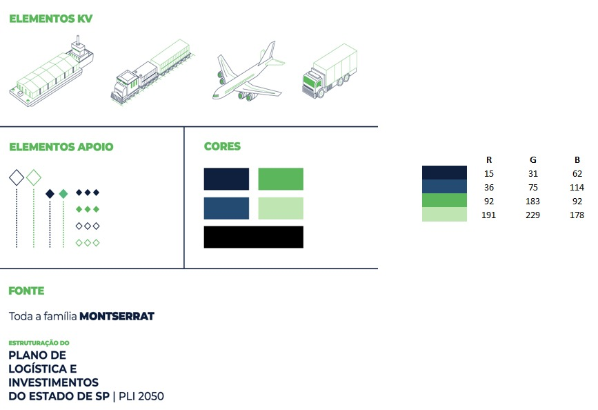

# 📋 Sistema de Gerenciamento de Cadastros PLI

Sistema web modular para gerenciamento de cadastros de Pessoa Física, Pessoa Jurídica e Usuários, desenvolvido para o Programa de Legalização de Imóveis (PLI).



## 🎯 Visão Geral

Esta aplicação oferece uma solução completa e segura para o gerenciamento de cadastros, com interface moderna, responsiva e funcionalidades avançadas de segurança e usabilidade.

### ✨ Características Principais

- **Interface Moderna**: Design responsivo baseado em Bootstrap 5
- **Segurança Avançada**: Autenticação JWT, criptografia e controle de sessão
- **Modularidade**: Código organizado em componentes reutilizáveis
- **Performance**: Sistema de cache, lazy loading e otimizações
- **Open Source**: 100% baseado em tecnologias abertas

## 🚀 Tecnologias Utilizadas

### Frontend
- **HTML5** + **CSS3** + **JavaScript ES6+**
- **Bootstrap 5** - Framework CSS responsivo
- **Font Awesome 6** - Ícones
- **DataTables** - Tabelas avançadas
- **Chart.js** - Gráficos e dashboards
- **SweetAlert2** - Alertas elegantes
- **jQuery** - Manipulação DOM

### Backend
- **Node.js** - Runtime JavaScript
- **Express.js** - Framework web
- **PostgreSQL** - Banco de dados
- **JWT** - Autenticação
- **Bcrypt** - Criptografia de senhas
- **Cors** - Controle de origem cruzada

### Infraestrutura
- **AWS RDS** - Banco de dados hospedado
- **Nginx** - Servidor web
- **PM2** - Gerenciador de processos
- **Docker** - Containerização
- **SSL/TLS** - Certificados de segurança

## 📁 Estrutura do Projeto

```
modulo_cadastro/
├── 📁 backend/                    # API Backend (Node.js + Express)
│   ├── 📁 src/
│   │   ├── 📁 config/            # Configurações
│   │   ├── 📁 controllers/       # Controladores
│   │   ├── 📁 middleware/        # Middlewares
│   │   ├── 📁 models/           # Modelos de dados
│   │   ├── 📁 routes/           # Rotas da API
│   │   ├── 📁 services/         # Serviços de negócio
│   │   └── 📁 utils/            # Utilitários
│   ├── package.json
│   └── server.js
├── 📁 frontend/                   # Interface Web
│   ├── 📁 public/
│   │   ├── 📁 css/              # Estilos CSS
│   │   ├── 📁 js/               # JavaScript modular
│   │   │   ├── 📁 components/   # Componentes JS
│   │   │   ├── 📁 services/     # Serviços frontend
│   │   │   └── 📁 pages/        # Scripts das páginas
│   │   └── 📁 images/           # Imagens e ícones
│   └── 📁 views/                # Páginas HTML
│       ├── 📁 components/       # Componentes HTML
│       ├── index.html           # Página inicial
│       ├── login.html           # Login
│       ├── dashboard.html       # Dashboard
│       ├── pessoa-fisica.html   # Cadastro PF
│       ├── pessoa-juridica.html # Cadastro PJ
│       └── usuarios.html        # Gestão usuários
├── 📁 database/                  # Documentação do BD
├── 📁 IDENTIDADE_VISUAL_PLI/     # Assets visuais
└── 📁 docs/                     # Documentação
```

## 🛠️ Instalação e Configuração

### Pré-requisitos
- Node.js 18+ 
- PostgreSQL 14+
- Git

### 1. Clone o repositório
```bash
git clone https://github.com/vpcapanema/pli_cadastros.git
cd pli_cadastros
```

### 2. Configuração do Backend
```bash
cd backend
npm install
```

### 3. Configuração do Banco de Dados
```bash
# Criar arquivo .env na pasta backend
cp .env.example .env

# Editar .env com suas configurações
# DB_HOST=localhost
# DB_PORT=5432
# DB_NAME=pli_cadastros
# DB_USER=seu_usuario
# DB_PASSWORD=sua_senha
# JWT_SECRET=sua_chave_secreta
```

### 4. Executar Migrations (quando disponível)
```bash
npm run migrate
```

### 5. Iniciar o servidor
```bash
# Desenvolvimento
npm run dev

# Produção
npm start
```

### 6. Configuração do Frontend
```bash
# Na pasta frontend, configurar servidor web
# Nginx, Apache ou servidor local

# Para desenvolvimento local
python -m http.server 8080
# ou
npx http-server
```

## 📱 Funcionalidades

### 🔐 Autenticação e Segurança
- [x] Login com email/senha
- [x] Recuperação de senha por email
- [x] Controle de sessão com timeout
- [x] Refresh automático de tokens
- [x] Criptografia de dados sensíveis
- [x] Proteção contra CSRF
- [x] Rate limiting

### 👤 Gestão de Usuários
- [x] CRUD completo de usuários
- [x] Níveis de permissão
- [x] Histórico de ações
- [x] Bloqueio/desbloqueio de contas
- [x] Alteração de senhas
- [x] Perfis de acesso

### 🧑 Pessoa Física
- [x] Cadastro completo com validação CPF
- [x] Integração com API ViaCEP
- [x] Upload de documentos
- [x] Histórico de alterações
- [x] Busca avançada e filtros
- [x] Exportação de dados

### 🏢 Pessoa Jurídica
- [x] Cadastro com validação CNPJ
- [x] Consulta automática de dados
- [x] Gestão de sócios
- [x] Documentos empresariais
- [x] Relatórios específicos
- [x] Acompanhamento de status

### 📊 Dashboard e Relatórios
- [x] Visão geral em tempo real
- [x] Gráficos interativos
- [x] Estatísticas de uso
- [x] Relatórios customizáveis
- [x] Exportação em múltiplos formatos
- [x] Filtros dinâmicos

### 🔧 Recursos Técnicos
- [x] Interface responsiva
- [x] Modo offline básico
- [x] Cache inteligente
- [x] Validação em tempo real
- [x] Máscaras automáticas
- [x] Internacionalização (i18n)

## 🧪 Testes

### Executar Testes
```bash
# Testes unitários
npm run test

# Testes de integração
npm run test:integration

# Coverage
npm run test:coverage
```

## 🚀 Deploy

### Ambiente de Produção
```bash
# Build do projeto
npm run build

# Deploy com PM2
npm run deploy

# Configurar Nginx
sudo nginx -t
sudo systemctl reload nginx
```

### Docker
```bash
# Build da imagem
docker build -t pli-cadastros .

# Executar container
docker run -p 3000:3000 -p 8080:8080 pli-cadastros
```

## 📖 Documentação

- [📋 Estrutura Completa](PROPOSTA_ESTRUTURA_APLICACAO.md)
- [🗄️ Banco de Dados](database/ANALISE_ESTRUTURA_DATABASE.md)
- [🎨 Identidade Visual](IDENTIDADE_VISUAL_PLI/)
- [🔧 Manual Técnico](docs/MANUAL_TECNICO.md)
- [👥 Manual do Usuário](docs/MANUAL_USUARIO.md)

## 🤝 Contribuindo

1. Fork o projeto
2. Crie uma branch para sua feature (`git checkout -b feature/AmazingFeature`)
3. Commit suas mudanças (`git commit -m 'Add some AmazingFeature'`)
4. Push para a branch (`git push origin feature/AmazingFeature`)
5. Abra um Pull Request

### Padrões de Código
- Seguir ESLint configurado
- Comentários em português
- Testes para novas funcionalidades
- Documentação atualizada

## 📝 Changelog

### v1.0.0 (2024-07-16)
- ✨ Lançamento inicial
- 🔐 Sistema de autenticação completo
- 👤 Gestão de usuários
- 🧑 Cadastro de pessoa física
- 🏢 Cadastro de pessoa jurídica
- 📊 Dashboard com relatórios
- 🎨 Interface responsiva com tema PLI

## 📄 Licença

Este projeto está sob a licença MIT. Veja o arquivo [LICENSE](LICENSE) para mais detalhes.

## 👥 Equipe

- **Desenvolvimento**: Equipe PLI
- **Design**: Baseado na identidade visual PLI
- **Arquitetura**: Padrões modernos e escaláveis

## 📞 Suporte

- **Email**: suporte@pli.gov.br
- **Issues**: [GitHub Issues](https://github.com/vpcapanema/pli_cadastros/issues)
- **Documentação**: [Wiki do Projeto](https://github.com/vpcapanema/pli_cadastros/wiki)

---

**Desenvolvido com ❤️ para o Programa de Legalização de Imóveis (PLI)**
