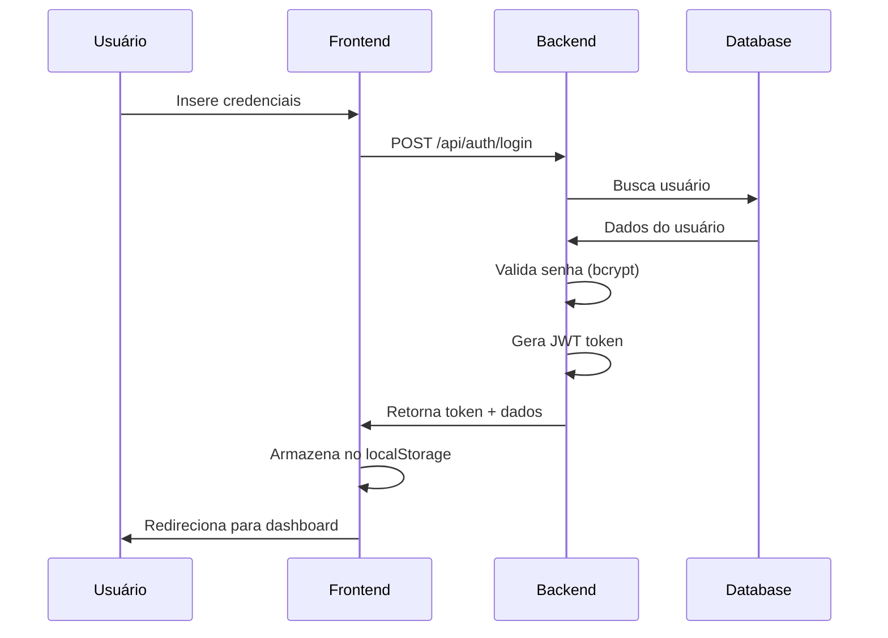
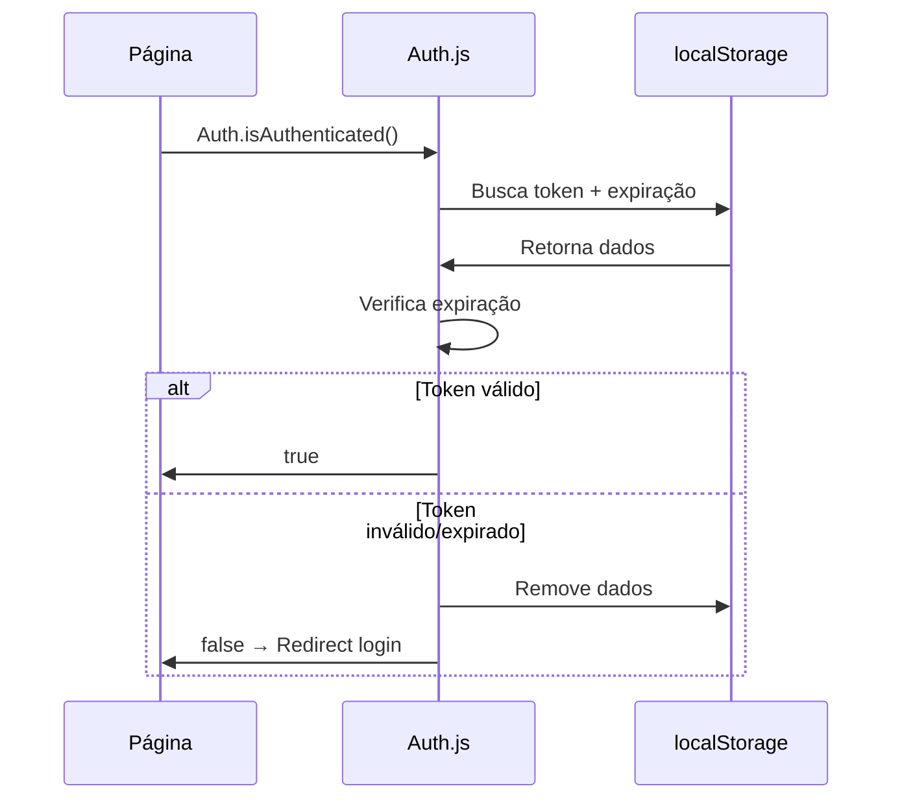
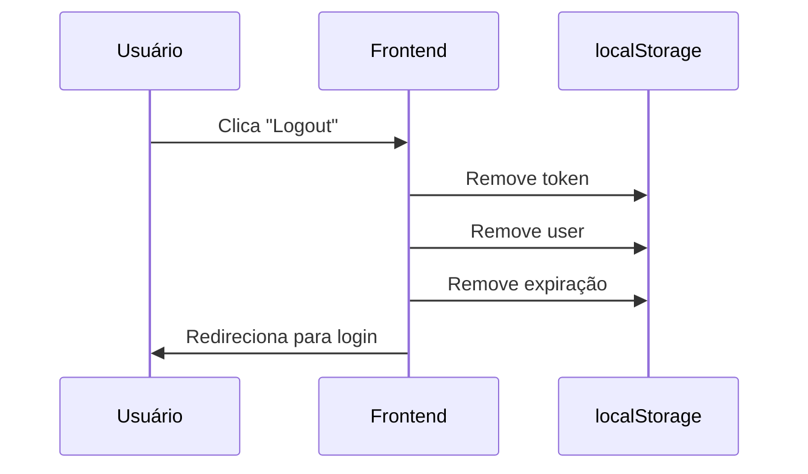

# 🔐 LÓGICA COMPLETA DE GERENCIAMENTO DE SESSÃO - SIGMA-PLI

## 📋 VISÃO GERAL

O sistema utiliza **JWT (JSON Web Tokens)** combinado com **localStorage** para gerenciar sessões de usuário de forma stateless e segura.

---

## 🚀 1. INICIALIZAÇÃO DA SESSÃO

### 1.1 Fluxo de Login (Frontend → Backend)

#### **Frontend (login.js):**
```javascript
// 1. Captura dados do formulário
const usuario = document.getElementById('email').value;
const password = document.getElementById('password').value;
const tipoUsuario = document.getElementById('tipoUsuario').value;

// 2. Envia dados para API
const loginData = await API.post('/auth/login', { 
    usuario, 
    password, 
    tipo_usuario: tipoUsuario 
});
```

#### **Backend (authController.js):**
```javascript
// 1. Validação de entrada
if (!usuario || !password || !tipo_usuario) {
    return res.status(400).json({ sucesso: false, mensagem: 'Campos obrigatórios' });
}

// 2. Busca usuário no banco
const isEmail = usuario.includes('@');
if (isEmail) {
    // Busca por email_institucional
    sqlQuery = `SELECT * FROM usuarios.usuario_sistema WHERE email_institucional = $1 AND tipo_usuario = $2`;
} else {
    // Busca por username
    sqlQuery = `SELECT * FROM usuarios.usuario_sistema WHERE username = $1 AND tipo_usuario = $2`;
}

// 3. Verificações de status e permissões
// 3.1. Status deve ser APROVADO
if (user.status !== 'APROVADO') {
    return res.status(403).json({ 
        sucesso: false, 
        mensagem: 'Usuário não aprovado. Aguarde a aprovação do administrador.',
        codigo: 'USUARIO_NAO_APROVADO'
    });
}

// 3.2. Usuário deve estar ativo
if (!user.ativo) {
    return res.status(403).json({ 
        sucesso: false, 
        mensagem: 'Usuário inativo. Entre em contato com o administrador.',
        codigo: 'USUARIO_INATIVO'
    });
}

// 3.3. Email institucional deve estar verificado
if (!user.email_institucional_verificado) {
    return res.status(403).json({ 
        sucesso: false, 
        mensagem: 'Email institucional não verificado. Verifique seu email antes de fazer login.',
        codigo: 'EMAIL_NAO_VERIFICADO'
    });
}

// 4. Verificação de senha
const senhaCorreta = await bcrypt.compare(password, user.senha_hash);

// 5. Geração do token JWT
const token = jwt.sign({
    id: user.id,
    email: user.email,
    nome: user.nome_completo,
    tipo_usuario: user.tipo_usuario,
    nivel_acesso: user.nivel_acesso
}, process.env.JWT_SECRET, { expiresIn: '24h' });
```

### 1.1.1 Regras de Validação Obrigatórias

Para que a autenticação seja bem-sucedida, **TODAS** as seguintes condições devem ser atendidas:

| Campo | Valor Obrigatório | Valor Padrão | Descrição |
|-------|------------------|--------------|-----------|
| `status` | `APROVADO` | `AGUARDANDO_APROVACAO` | Usuário deve estar aprovado pelo administrador |
| `ativo` | `true` | `false` | Usuário deve estar ativo no sistema |
| `email_institucional_verificado` | `true` | `false` | Email institucional deve estar verificado |

#### **Tratamento de Erros Específicos:**

```javascript
// Frontend - Códigos de erro que recarregam a página
const codigosQueRecarregam = ['USUARIO_NAO_APROVADO', 'USUARIO_INATIVO', 'EMAIL_NAO_VERIFICADO'];

if (codigosQueRecarregam.includes(loginData.codigo)) {
    // Exibe modal específico e recarrega página após fechamento
    showAuthErrorWithReload(loginData.codigo, motivo, logs);
}
```

#### **Mensagens de Erro por Código:**

- **`USUARIO_NAO_APROVADO`**: "Usuário não aprovado. Aguarde a aprovação do administrador."
- **`USUARIO_INATIVO`**: "Usuário inativo. Entre em contato com o administrador."  
- **`EMAIL_NAO_VERIFICADO`**: "Email institucional não verificado. Verifique seu email antes de fazer login."

### 1.2 Armazenamento da Sessão (Frontend)

#### **Auth.loginFromApi():**
```javascript
loginFromApi(token, user) {
    // 1. Armazena token JWT
    localStorage.setItem('token', token);
    
    // 2. Armazena dados do usuário
    localStorage.setItem('user', JSON.stringify(user));
    
    // 3. Define expiração (24 horas)
    const expiration = new Date().getTime() + (24 * 60 * 60 * 1000);
    localStorage.setItem('tokenExpiration', expiration);
    
    // 4. Registra último login
    localStorage.setItem('lastLogin', new Date().toISOString());
}
```

### 1.3 Dados Armazenados no localStorage

| Chave | Tipo | Descrição | Exemplo |
|-------|------|-----------|---------|
| `token` | String | JWT Token | `eyJhbGciOiJIUzI1NiIsInR5cCI6IkpXVCJ9...` |
| `user` | JSON | Dados do usuário | `{"id":"123","nome":"João","tipo_usuario":"ADMIN"}` |
| `tokenExpiration` | Number | Timestamp de expiração | `1706467200000` |
| `lastLogin` | String | Data/hora do último login | `2025-07-28T13:20:00.000Z` |

---

## 🔒 2. VERIFICAÇÃO DE SESSÃO

### 2.1 Verificação Frontend (isAuthenticated)

#### **Auth.isAuthenticated():**
```javascript
isAuthenticated() {
    const token = localStorage.getItem('token');
    const expiration = localStorage.getItem('tokenExpiration');
    const now = new Date().getTime();
    
    // 1. Verifica se existe token e expiração
    if (!token || !expiration) {
        console.log('[SESSION] Token ou expiração ausente');
        return false;
    }
    
    // 2. Verifica se não expirou
    if (now > parseInt(expiration)) {
        console.log('[SESSION] Token expirado');
        this.logout(); // Limpa dados
        return false;
    }
    
    // 3. Sessão válida
    return true;
}
```

### 2.2 Verificação Backend (authMiddleware)

#### **verificarAutenticacao():**
```javascript
exports.verificarAutenticacao = (req, res, next) => {
    // 1. Extrai token do header Authorization
    const authHeader = req.headers.authorization;
    if (!authHeader || !authHeader.startsWith('Bearer ')) {
        return res.status(401).json({ sucesso: false, mensagem: 'Token não fornecido' });
    }
    
    const token = authHeader.split(' ')[1];
    
    // 2. Verifica e decodifica token JWT
    const decoded = jwt.verify(token, process.env.JWT_SECRET);
    
    // 3. Adiciona dados do usuário à requisição
    req.usuario = decoded;
    
    next(); // Continua para próximo middleware/rota
};
```

### 2.3 Fluxo de Verificação em Páginas Protegidas

```javascript
// 1. Página carrega → verifica autenticação
if (!Auth.isAuthenticated()) {
    // Redireciona para login
    window.location.href = '/login.html?next=' + encodeURIComponent(window.location.pathname);
    return;
}

// 2. Requisições à API incluem token
const response = await API.get('/endpoint');
// API.get automaticamente inclui: headers: { 'Authorization': 'Bearer ' + token }
```

---

## 🔄 3. ATUALIZAÇÃO DA SESSÃO

### 3.1 Renovação Automática

#### **Não Implementada - Sessão Expira em 24h:**
- Token JWT tem validade fixa de 24 horas
- Não há renovação automática (stateless)
- Usuário deve fazer login novamente após expiração

### 3.2 Atualização de Dados do Usuário

#### **Quando dados do usuário mudam no backend:**
```javascript
// Frontend deve buscar dados atualizados
const user = await API.get('/auth/me'); // Rota protegida
localStorage.setItem('user', JSON.stringify(user));
```

### 3.3 Sincronização Entre Abas

#### **localStorage Events:**
```javascript
// Detecta mudanças no localStorage entre abas
window.addEventListener('storage', (e) => {
    if (e.key === 'token' && !e.newValue) {
        // Token removido em outra aba → força logout
        window.location.href = '/login.html';
    }
});
```

---

## 🚪 4. FECHAMENTO DA SESSÃO

### 4.1 Logout Manual

#### **Auth.logout():**
```javascript
logout(redirect = true) {
    // 1. Remove dados do localStorage
    localStorage.removeItem('token');
    localStorage.removeItem('user');
    localStorage.removeItem('tokenExpiration');
    localStorage.removeItem('lastLogin');
    
    // 2. Redireciona para login (opcional)
    if (redirect) {
        window.location.href = '/login.html';
    }
}
```

### 4.2 Logout Automático

#### **4.2.1 Expiração de Token:**
```javascript
// Verificado em cada Auth.isAuthenticated()
if (now > parseInt(expiration)) {
    this.logout(); // Logout automático
    return false;
}
```

#### **4.2.2 Fechamento de Aba/Navegador:**
```javascript
Auth.enableAutoLogoutOnClose(); // Chama em páginas restritas

enableAutoLogoutOnClose() {
    window.addEventListener('beforeunload', () => {
        if (Auth.isAuthenticated()) {
            Auth.logout(false); // Logout sem redirect
        }
    });
}
```

### 4.3 Logout no Backend

#### **authController.logout():**
```javascript
exports.logout = async (req, res) => {
    // JWT é stateless - não há invalidação no servidor
    // Apenas limpa cookies (se houver)
    res.clearCookie('token');
    
    res.status(200).json({
        sucesso: true,
        mensagem: 'Logout realizado com sucesso'
    });
};
```

---

## 🔐 5. SEGURANÇA DA SESSÃO

### 5.1 Medidas de Segurança Implementadas

#### **5.1.1 JWT Security:**
- **Secret forte:** Armazenado em variável de ambiente
- **Expiração:** 24 horas máximo
- **Payload mínimo:** Apenas dados essenciais

#### **5.1.2 Frontend Security:**
- **localStorage:** Dados sensíveis não expostos
- **Validação URLs:** Whitelist para redirecionamento
- **Auto-logout:** Em fechamento de aba/navegador

#### **5.1.3 Backend Security:**
- **bcrypt:** Hash seguro de senhas
- **Middleware:** Verificação em todas as rotas protegidas
- **Headers CORS:** Configurados adequadamente

### 5.2 Vulnerabilidades Mitigadas

| Vulnerabilidade | Mitigação |
|-----------------|-----------|
| **XSS** | Headers de segurança, validação de entrada |
| **CSRF** | JWT em headers (não cookies) |
| **Session Hijacking** | HTTPS obrigatório, expiração curta |
| **Brute Force** | Rate limiting (pode ser implementado) |
| **Token Theft** | localStorage (mais seguro que cookies) |

---

## 📊 6. FLUXOS COMPLETOS

### 6.1 Fluxo de Login Completo



### 6.2 Fluxo de Verificação de Sessão



### 6.3 Fluxo de Logout



---

## ⚙️ 7. CONFIGURAÇÕES

### 7.1 Variáveis de Ambiente

```env
# JWT Configuration
JWT_SECRET=sua_chave_secreta_muito_forte
JWT_EXPIRES_IN=24h

# Session Configuration
SESSION_TIMEOUT=86400000  # 24 horas em ms
```

### 7.2 Configurações Frontend

```javascript
// SecurityConfig.js
AUTH: {
    TOKEN_EXPIRY_HOURS: 24,
    MIN_PASSWORD_LENGTH: 8,
    MAX_LOGIN_ATTEMPTS: 3,
    LOCKOUT_DURATION_MINUTES: 15
}
```

---

## 🎯 8. BOAS PRÁTICAS IMPLEMENTADAS

### ✅ **O que está funcionando bem:**

1. **Stateless JWT:** Escalável e performático
2. **Expiração controlada:** 24h máximo
3. **Validação robusta:** Frontend + Backend
4. **Logout automático:** Segurança em fechamento
5. **Logs detalhados:** Debug e auditoria
6. **Middleware reutilizável:** Proteção de rotas

### 🔄 **Melhorias Possíveis:**

1. **Refresh tokens:** Para renovação sem re-login
2. **Rate limiting:** Proteção contra brute force
3. **Session invalidation:** Lista negra de tokens
4. **Multi-device tracking:** Controle de sessões simultâneas
5. **Audit logs:** Registro de atividades de login

---

## 📝 **RESUMO EXECUTIVO**

O sistema implementa um **gerenciamento de sessão robusto e seguro** baseado em:

- **JWT stateless** para autenticação
- **localStorage** para persistência local
- **Middleware de verificação** em todas as rotas protegidas
- **Logout automático** por expiração e fechamento
- **Validação em múltiplas camadas** (Frontend + Backend)

A arquitetura garante **segurança, performance e usabilidade** adequadas para um sistema corporativo.
