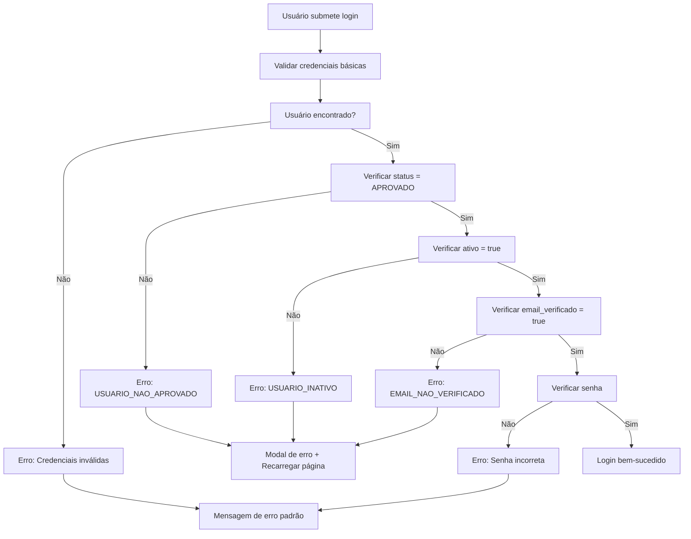

# 🔐 REGRAS DE AUTENTICAÇÃO APRIMORADAS - SIGMA-PLI

## 📋 VISÃO GERAL

Este documento descreve as **regras de validação obrigatórias** implementadas no processo de autenticação do sistema SIGMA-PLI para garantir maior segurança e controle de acesso.

---

## ✅ REGRAS OBRIGATÓRIAS

Para que um usuário possa fazer login com sucesso, **TODAS** as seguintes condições devem ser atendidas:

### 1. **Status de Aprovação**
- **Campo:** `status`
- **Valor Obrigatório:** `APROVADO`
- **Valor Padrão:** `AGUARDANDO_APROVACAO`
- **Descrição:** O usuário deve ter sido aprovado por um administrador

### 2. **Status de Ativo**
- **Campo:** `ativo`
- **Valor Obrigatório:** `true`
- **Valor Padrão:** `false`
- **Descrição:** O usuário deve estar ativo no sistema

### 3. **Email Institucional Verificado**
- **Campo:** `email_institucional_verificado`
- **Valor Obrigatório:** `true`
- **Valor Padrão:** `false`
- **Descrição:** O usuário deve ter verificado seu email institucional

---

## 🚫 COMPORTAMENTO EM CASO DE VIOLAÇÃO

### **Fluxo de Tratamento de Erro:**

1. **Detecção:** O sistema identifica qual regra foi violada
2. **Interrupção:** O processo de autenticação é imediatamente interrompido
3. **Feedback:** Uma mensagem específica é exibida ao usuário
4. **Recarregamento:** Após o usuário fechar a mensagem, a página é recarregada

### **Códigos de Erro Específicos:**

| Código | Condição Violada | Mensagem de Erro |
|--------|------------------|------------------|
| `USUARIO_NAO_APROVADO` | status ≠ 'APROVADO' | "Usuário não aprovado. Aguarde a aprovação do administrador." |
| `USUARIO_INATIVO` | ativo ≠ true | "Usuário inativo. Entre em contato com o administrador." |
| `EMAIL_NAO_VERIFICADO` | email_institucional_verificado ≠ true | "Email institucional não verificado. Verifique seu email antes de fazer login." |

---

## 🛠️ IMPLEMENTAÇÃO TÉCNICA

### **Backend (authController.js)**

```javascript
// Verificação de status
if (String(user.status).toUpperCase() !== 'APROVADO') {
    return res.status(403).json({
        sucesso: false,
        mensagem: 'Usuário não aprovado. Aguarde a aprovação do administrador.',
        codigo: 'USUARIO_NAO_APROVADO'
    });
}

// Verificação de ativo
if (!user.ativo) {
    return res.status(403).json({
        sucesso: false,
        mensagem: 'Usuário inativo. Entre em contato com o administrador.',
        codigo: 'USUARIO_INATIVO'
    });
}

// Verificação de email verificado
if (!user.email_institucional_verificado) {
    return res.status(403).json({
        sucesso: false,
        mensagem: 'Email institucional não verificado. Verifique seu email antes de fazer login.',
        codigo: 'EMAIL_NAO_VERIFICADO'
    });
}
```

### **Frontend (login.js)**

```javascript
// Códigos que requerem recarregamento da página
const codigosQueRecarregam = ['USUARIO_NAO_APROVADO', 'USUARIO_INATIVO', 'EMAIL_NAO_VERIFICADO'];

// Tratamento específico para erros de validação
if (codigosQueRecarregam.includes(loginData.codigo)) {
    showAuthErrorWithReload(loginData.codigo, motivo, logs);
} else {
    showFinalLoginMessage('danger', 'Falha no login', logs, motivo);
}
```

---

## 🎯 INTERFACE DO USUÁRIO

### **Modal de Erro Personalizado:**

- **Título Dinâmico:** Baseado no tipo de erro
- **Ícone Específico:** Visual diferenciado para cada tipo de erro
- **Mensagem Clara:** Explicação detalhada do problema
- **Ação Obrigatória:** Usuário deve clicar "Entendi" para prosseguir
- **Recarregamento Automático:** Página é recarregada após fechamento do modal

### **Mapeamento Visual:**

| Código | Título | Ícone | Cor |
|--------|--------|-------|-----|
| `USUARIO_NAO_APROVADO` | "Usuário Não Aprovado" | `fas fa-user-clock` | Amarelo (Warning) |
| `USUARIO_INATIVO` | "Usuário Inativo" | `fas fa-user-slash` | Vermelho (Danger) |
| `EMAIL_NAO_VERIFICADO` | "Email Não Verificado" | `fas fa-envelope-open-text` | Azul (Info) |

---

## 📊 VALORES PADRÃO DA TABELA

### **Configuração Inicial:**

```sql
-- Valores padrão para novos usuários
ALTER TABLE usuarios.usuario_sistema 
ALTER COLUMN status SET DEFAULT 'AGUARDANDO_APROVACAO';

ALTER TABLE usuarios.usuario_sistema 
ALTER COLUMN ativo SET DEFAULT false;

ALTER TABLE usuarios.usuario_sistema 
ALTER COLUMN email_institucional_verificado SET DEFAULT false;
```

### **Estados Possíveis do Status:**

- `AGUARDANDO_APROVACAO` (padrão)
- `APROVADO`
- `REJEITADO`
- `SUSPENSO`
- `INATIVO`

---

## 🔄 FLUXO COMPLETO DE VALIDAÇÃO



---

## 📝 CONSIDERAÇÕES IMPORTANTES

### **Segurança:**
- ✅ Verificações são feitas no backend (servidor)
- ✅ Frontend apenas exibe feedback adequado
- ✅ Logs detalhados para auditoria
- ✅ Códigos de erro padronizados

### **Usabilidade:**
- ✅ Mensagens claras e específicas
- ✅ Interface visual diferenciada por tipo de erro
- ✅ Recarregamento automático para reset do estado
- ✅ Feedback em tempo real

### **Administração:**
- ✅ Novos usuários são criados em estado seguro (não aprovado)
- ✅ Administradores devem ativar manualmente cada usuário
- ✅ Processo de verificação de email obrigatório
- ✅ Controle granular de acesso

---

## 📅 DATA DE IMPLEMENTAÇÃO

**Implementado em:** 2 de agosto de 2025  
**Versão:** Sistema SIGMA-PLI v1.0.0  
**Responsável:** Equipe de Desenvolvimento SIGMA-PLI
