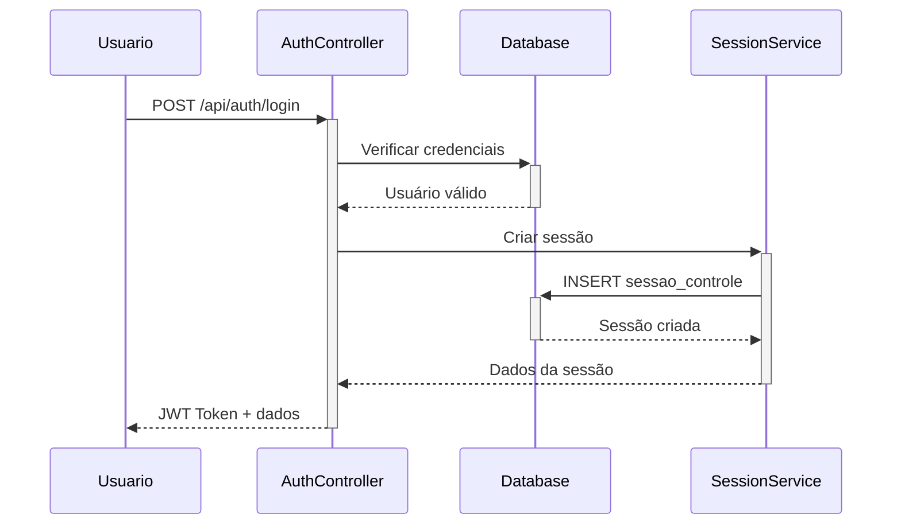
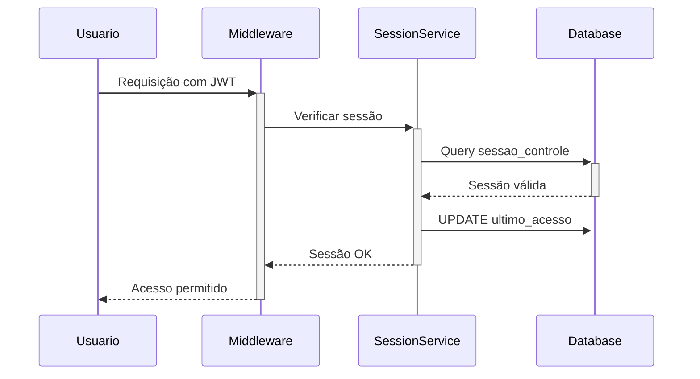
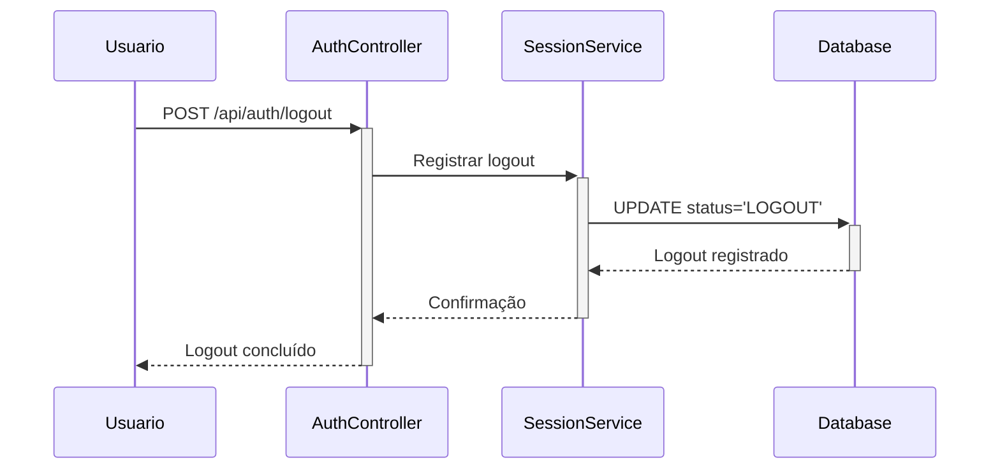

# Sistema de Controle de Sessões - SIGMA-PLI

## 📋 Visão Geral

O Sistema de Controle de Sessões foi implementado para fornecer um controle robusto e auditável das sessões de usuários no SIGMA-PLI. Este sistema inclui:

- ✅ **Rastreamento completo de sessões** (login, atividade, logout)
- ✅ **Auditoria de segurança** com logs detalhados
- ✅ **Gerenciamento automático** de sessões expiradas
- ✅ **Controle de múltiplas sessões** por usuário
- ✅ **Estatísticas e monitoramento** em tempo real
- ✅ **Invalidação forçada** para administradores

## 🗃️ Estrutura do Banco de Dados

### Tabela Principal: `usuarios.sessao_controle`

```sql
CREATE TABLE usuarios.sessao_controle (
    id UUID PRIMARY KEY DEFAULT gen_random_uuid(),
    usuario_id UUID NOT NULL REFERENCES usuarios.usuario_sistema(id),
    token_jwt_hash VARCHAR(64) NOT NULL,  -- SHA-256 do token JWT
    session_id UUID UNIQUE NOT NULL DEFAULT gen_random_uuid(),
    data_login TIMESTAMP WITH TIME ZONE NOT NULL DEFAULT CURRENT_TIMESTAMP,
    data_ultimo_acesso TIMESTAMP WITH TIME ZONE NOT NULL DEFAULT CURRENT_TIMESTAMP,
    data_logout TIMESTAMP WITH TIME ZONE,
    data_expiracao TIMESTAMP WITH TIME ZONE NOT NULL,
    endereco_ip INET,
    user_agent TEXT,
    dispositivo_info JSONB,  -- {browser, version, os, device}
    localizacao_info JSONB,  -- Para futuro uso com geolocalização
    status_sessao VARCHAR(20) NOT NULL DEFAULT 'ATIVA',
    motivo_encerramento VARCHAR(50),
    data_criacao TIMESTAMP WITH TIME ZONE NOT NULL DEFAULT CURRENT_TIMESTAMP,
    data_atualizacao TIMESTAMP WITH TIME ZONE NOT NULL DEFAULT CURRENT_TIMESTAMP
);
```

### Views Auxiliares

- `vw_sessoes_ativas`: Lista sessões ativas com informações do usuário
- `vw_estatisticas_login`: Estatísticas de login por período

### Funções

- `fn_limpar_sessoes_antigas()`: Remove sessões antigas automaticamente
- `fn_invalidar_sessoes_usuario()`: Invalida todas as sessões de um usuário

## 🔧 Arquitetura de Componentes

### 1. SessionService (`src/services/sessionService.js`)

Serviço principal para gerenciamento de sessões:

```javascript
// Criar nova sessão
await SessionService.criarSessao(userId, token, req);

// Verificar sessão válida
const sessao = await SessionService.verificarSessao(tokenHash);

// Registrar logout
await SessionService.registrarLogout(tokenHash, 'LOGOUT_MANUAL');

// Invalidar todas as sessões de um usuário
await SessionService.invalidarSessoesUsuario(userId, 'ADMIN_FORCED');
```

### 2. Middleware de Autenticação (`src/middleware/sessionAuth.js`)

Middleware aprimorado que verifica JWT + sessão no banco:

```javascript
// Verificação básica de autenticação
app.use('/api/protected', verificarAutenticacao);

// Verificação por tipo de usuário
app.use('/api/admin', verificarAdmin);
app.use('/api/gestao', verificarGestao);

// Verificação por nível de acesso
app.use('/api/nivel3', verificarNivelAcesso(3));
```

### 3. Controlador de Autenticação Atualizado (`src/controllers/authController.js`)

Integração com o sistema de sessões:

- ✅ Cria sessão no banco durante login
- ✅ Registra logout na tabela de controle
- ✅ Log detalhado de todas as operações

### 4. Rotas de Gerenciamento (`src/routes/sessions.js`)

API completa para controle de sessões:

```bash
GET    /api/sessions/minhas           # Listar minhas sessões
DELETE /api/sessions/invalidar-outras # Invalidar outras sessões
GET    /api/sessions/info             # Info da sessão atual
GET    /api/sessions/ativas           # Todas as sessões (admin)
POST   /api/sessions/limpar-expiradas # Limpeza manual (admin)
```

### 5. Jobs Automáticos (`src/services/sessionJobs.js`)

Sistema de manutenção automática:

- **A cada 15 min**: Marca sessões inativas (2h+ sem acesso)
- **A cada 30 min**: Marca sessões expiradas
- **Diariamente 02:00**: Remove registros antigos (90+ dias)
- **Diariamente 23:59**: Gera estatísticas do dia

## 🚀 Configuração e Instalação

### 1. Instalar Dependências

```bash
npm install node-cron
```

### 2. Criar Tabela e Estruturas

```bash
# Executar setup da tabela
node tools/setup-sessions.js

# Com dados de teste (opcional)
node tools/setup-sessions.js --test-data
```

### 3. Inicializar Jobs no Server.js

```javascript
// Adicionar ao server.js
const sessionJobs = require('./src/services/sessionJobs');

// Após inicialização do servidor
sessionJobs.iniciarJobs();

// Cleanup na saída
process.on('SIGTERM', () => {
  sessionJobs.pararJobs();
});
```

## 📊 Monitoramento e Estatísticas

### Painel de Controle de Sessões

```javascript
// Estatísticas em tempo real
GET /api/sessions/estatisticas?dias=30

Response:
{
  "sucesso": true,
  "periodo_dias": 30,
  "estatisticas": {
    "total_sessoes": 150,
    "usuarios_unicos": 25,
    "sessoes_ativas": 8,
    "logins_hoje": 12,
    "duracao_media_minutos": 45
  }
}
```

### Sessões Ativas

```javascript
// Listar todas as sessões ativas (admin)
GET /api/sessions/ativas?limit=50&offset=0

Response:
{
  "sucesso": true,
  "sessoes": [
    {
      "session_id": "uuid-here",
      "usuario": {
        "id": "user-uuid",
        "username": "joao.silva",
        "nome": "João Silva",
        "tipo_usuario": "ANALISTA"
      },
      "data_login": "2024-01-20T10:30:00Z",
      "endereco_ip": "192.168.1.100",
      "dispositivo": {"browser": "Chrome", "os": "Windows"},
      "minutos_inativo": 15,
      "status": "ATIVA"
    }
  ]
}
```

## 🛡️ Segurança

### Proteções Implementadas

1. **Hash de Tokens**: Tokens JWT são hasheados (SHA-256) antes do armazenamento
2. **Validação Dupla**: Verificação JWT + consulta ao banco de dados
3. **Expiração Automática**: Sessões expiram automaticamente
4. **Auditoria Completa**: Log de todas as ações de sessão
5. **Invalidação Forçada**: Administradores podem forçar logout
6. **Detecção de Inatividade**: Sessões são marcadas como inativas

### Estados de Sessão

- `ATIVA`: Sessão válida e em uso
- `LOGOUT`: Encerrada pelo usuário
- `EXPIRADA`: Tempo de vida esgotado
- `INVALIDADA`: Forçada pelo administrador
- `INATIVA`: Sem atividade por período prolongado

## 🔄 Fluxo de Autenticação

### 1. Login



### 2. Requisição Autenticada



### 3. Logout



## 📝 Logs e Auditoria

### Estrutura de Logs

```javascript
// Log de login
[SESSION] Nova sessão criada: session-uuid para usuário user-uuid

// Log de acesso
[SESSION] Último acesso atualizado: session-uuid

// Log de logout
[SESSION] Logout registrado: session-uuid - Motivo: LOGOUT_MANUAL

// Log de invalidação
[SESSION] 3 sessões invalidadas para usuário user-uuid
```

### Consultas de Auditoria

```sql
-- Histórico de logins de um usuário
SELECT data_login, endereco_ip, dispositivo_info, status_sessao
FROM usuarios.sessao_controle
WHERE usuario_id = 'user-uuid'
ORDER BY data_login DESC;

-- Sessões por período
SELECT DATE(data_login), COUNT(*) as total_logins
FROM usuarios.sessao_controle
WHERE data_login >= CURRENT_DATE - INTERVAL '30 days'
GROUP BY DATE(data_login);
```

## 🚨 Alertas e Monitoramento

### Situações que Geram Alertas

1. **Múltiplos Logins Simultâneos**: Mesmo usuário, IPs diferentes
2. **Sessões de Longa Duração**: Sessões ativas por mais de 24h
3. **Tentativas de Acesso com Sessão Expirada**: Possível ataque
4. **Volume Alto de Logins**: Detecção de automação

### Implementação de Alertas

```javascript
// Exemplo de verificação no middleware
if (sessao.minutos_inativo > 1440) {
  // 24 horas
  console.warn(`[ALERT] Sessão de longa duração: ${sessao.session_id}`);
  // Enviar notificação para administradores
}
```

## 📚 Manutenção

### Comandos Úteis

```bash
# Setup inicial
node tools/setup-sessions.js

# Limpeza manual
node -e "require('./src/services/sessionJobs').limpezaManual()"

# Verificar estatísticas
curl -H "Authorization: Bearer TOKEN" http://localhost:3000/api/sessions/estatisticas

# Invalidar sessões de usuário
curl -X POST -H "Authorization: Bearer ADMIN_TOKEN" \
     http://localhost:3000/api/sessions/invalidar-usuario/USER_ID
```

### Troubleshooting

1. **Sessões não sendo criadas**: Verificar se a tabela existe e está acessível
2. **Jobs não executando**: Verificar se `sessionJobs.iniciarJobs()` foi chamado
3. **Logs de erro**: Monitorar console para erros de conexão com banco
4. **Performance**: Analisar índices na tabela para consultas frequentes

## 🎯 Próximos Passos

1. **Implementar no Frontend**: Atualizar `auth.js` para usar `/api/sessions/info`
2. **Painel de Administração**: Interface para gerenciar sessões
3. **Alertas por Email**: Notificações automáticas para administradores
4. **Geolocalização**: Adicionar informações de localização das sessões
5. **Rate Limiting**: Implementar limitação de tentativas de login

---

**📌 Sistema implementado com sucesso! Para ativar, execute:**

```bash
# 1. Criar tabela no banco
node tools/setup-sessions.js

# 2. Reiniciar servidor
npm restart

# 3. Testar login para verificar criação de sessões
```
